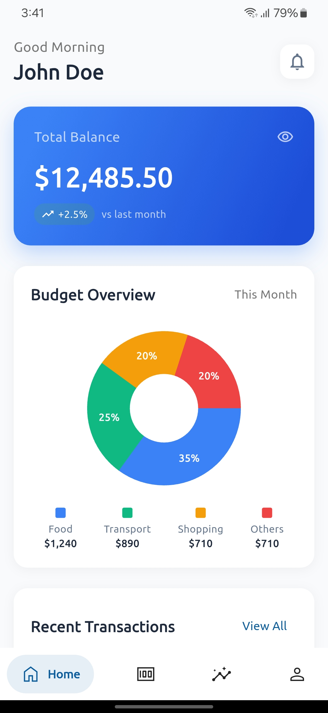
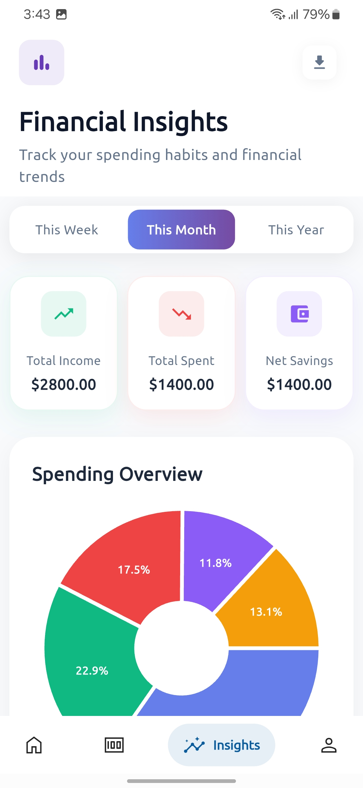
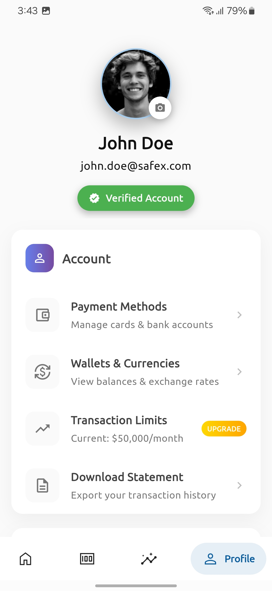

---

## 🛡️ SafeX – Your Trusted Digital Wallet

Welcome to **SafeX**, your next-gen digital wallet built with **Flutter**, **Firebase**, and **Stripe**. Easily transfer money, view insights, and manage your finances — all with a sleek, secure UI.

> 💸 Safe. Simple. Swift.

> This application is currently under development, we have only implemented the UI, not the actual features, you are welcome to try it out and provide feedback, that will help us a lot, thanks.

---

### 📱 Screenshots

| Home                          | Transfers                               | Insights                              | Profile                             |
| ----------------------------- | --------------------------------------- | ------------------------------------- | ----------------------------------- |
|  |  |  |  |

---

### 🧠 Features

* 🔐 Firebase Authentication
* 💳 Seamless Payments via Stripe
* 📊 Real-time Insights & Charts
* 🏦 Quick Transfers with QR support
* 🧾 Transaction History
* 👤 Profile Management
* 🌙 Light & Dark Theme Support
* 🪄 Smooth Animations (yep, it’s got flair)

---

### 🧰 Tech Stack

* **Flutter** – Cross-platform frontend
* **Firebase** – Auth, Firestore, Cloud Functions
* **Stripe** – Payment processing
* **Riverpod** – State management
* **Dio** – API calls
* **Flutter Animations** – `flutter_animate`, `Lottie`, etc.

---

### 🚀 Getting Started

Clone the repo and run the app:

```bash
git clone https://github.com/theprantadutta/safex.git
cd safex
flutter pub get
flutter run
```

Make sure to set up your own Firebase project and Stripe keys.

---

<!-- ### 🎨 Theme Preview

| Light Mode                            | Dark Mode                           |
| ------------------------------------- | ----------------------------------- |
|  |  |

--- -->

<!-- ### 📦 Folder Structure (short & clean)

```
lib/
├── main.dart
├── core/
├── screens/
│   ├── home/
│   ├── transfers/
│   ├── insights/
│   └── profile/
├── widgets/
└── services/
``` -->

---

### 🤝 Contributing

Pull requests are welcome. For major changes, please open an issue first.
Let’s build something cool together 🧠⚡

---

### 📄 License

[MIT](LICENSE)